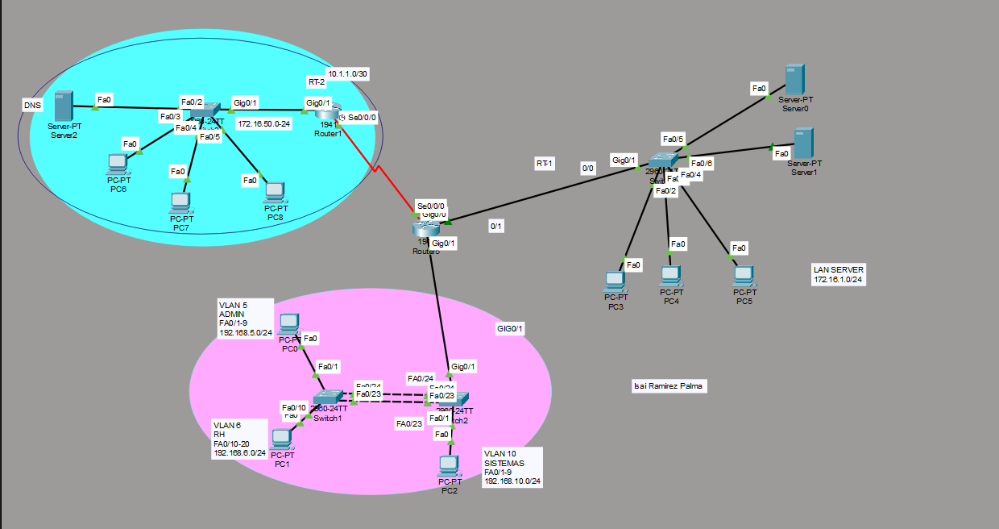

# Configuración de EtherChannel · STP · VLAN · DHCP

# SWITCH DE ENLACES REDUNDANTES (SW-01)

```
ena
conf term
hostname SW-01

VLAN 5
name ADMIN
exit

VLAN 6
name RH
exit

interface range Fa0/1-9
switchport mode access
switchport access vlan 5
exit

interface range Fa0/10-20
switchport mode access
switchport access vlan 6
exit

interface range Fa0/23-24
channel-group 1 mode active
exit

interface Port-channel 1
switchport mode trunk
exit


```

# OTRO SWITCH REDUNDANTE (SW-02)

*(Este se hace dos troncales ya que conecta al router)*

```
ena
conf term
hostname SW-02

VLAN 5
name ADMIN
exit

VLAN 6
name RH
exit

VLAN 10
name SISTEMAS
exit

interface range Fa0/1-9
switchport mode access
switchport access vlan 10
exit

interface range Fa0/23-24
channel-group 1 mode active
exit

interface Port-channel 1
switchport mode trunk
exit

! Troncal al router
interface Gig0/1
switchport mode trunk
exit
```

# ROUTER QUE VIENE AL SWITCH (RT-01)

```
ena 
conf term
hostname RT-01

! Troncal hacia switches
interface Gig0/1
no shut
exit


! -------- VLAN 5 --------
interface Gig0/1.5
encapsulation dot1Q 5
ip add 192.168.5.254 255.255.255.0
no shut
exit

! -------- VLAN 6 --------
interface Gig0/1.6
encapsulation dot1Q 6
ip add 192.168.6.254 255.255.255.0
no shut
exit

! -------- VLAN 10 --------
interface Gig0/1.10
encapsulation dot1Q 10
ip add 192.168.10.254 255.255.255.0
no shut
exit


! -------- Red hacia servidor --------
interface Gig0/0
ip add 172.16.1.254 255.255.255.0
no shut
exit


!//////////////////// SERIAL ENTRE ROUTERS ////////////////////

interface Serial0/0/0
ip add 10.1.1.1 255.255.255.252
no shut
exit
```

# ROUTER 2 (RT-02)

```
ena
conf term
hostname RT-02


interface Gig0/1
ip add 172.16.50.1 255.255.255.0
no shut
exit


! Serial hacia RT-01
interface Serial0/0/0
ip add 10.1.1.2 255.255.255.252
no shut
exit


! DHCP

ip dhcp excluded-address 172.16.50.1 172.16.50.9
ip dhcp excluded-address 172.16.50.254

ip dhcp pool RED-LOCAL

network 172.16.50.0 255.255.255.0

default-router 172.16.50.1

dns-server 172.16.50.254

domain-name empresa.local

exit
```

---

# PKT


