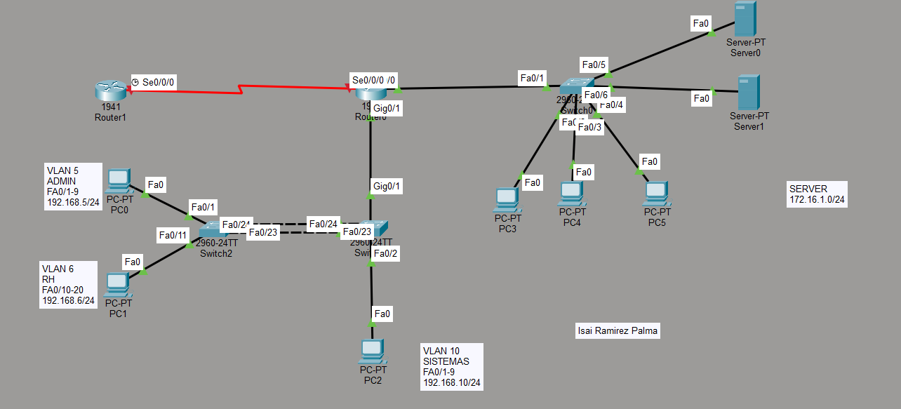

# Configuración de EtherChannel · STP · VLAN · DHCP


#  SWITCH DE ENLACES REDUNDANTES (SW-01)

```
ena
conf term
hostname SW-01

VLAN 5
name ADMIN
exit

VLAN 6
name RH
exit

interface range Fa0/1-9
switchport Mode Access
switchport Access Vlan 5
exit

interface range Fa0/10-20
switchport Mode Access
switchport Access Vlan 6
exit

interface range Fa0/23-24
channel-group 1 Mode Active
exit 

interface Port-channel 1
switchport mode Trunk 
exit
```


#  OTRO SWITCH REDUNDANTE (SW-02)

*(Este se hace dos troncales ya que conecta al router)*

```bash
ena
conf term
hostname SW-02

VLAN 5
name ADMIN
exit

VLAN 6
name RH
exit

VLAN 10
name SISTEMAS
exit

interface range Fa0/1-9
switchport Mode Access
switchport Access Vlan 10
exit

interface range Fa0/23-24
channel-group 1 Mode Active
exit 

interface Port-channel 1
switchport mode Trunk 
exit

!Interface que va al router

Interface Gig0/1
switchport mode trunk
exit
```


#  ROUTER QUE VIENE AL SWITCH (RT-01)

```bash
ena 
conf term
hostname RT-01

Interface Gig0/1
Description SVI
no shut
exit

!Depende de cuantas VLANS TENGAS

interface Gig0/1.5
Description SVI-5
Encapsulation Dot1Q 5
ip add 192.168.5.254 255.255.255.0
no shut
exit

interface Gig0/1.6
Description SVI-6
Encapsulation Dot1Q 6
ip add 192.168.6.254 255.255.255.0
no shut
exit

interface Gig0/1.10
Description SVI-10
Encapsulation Dot1Q 10
ip add 192.168.10.254 255.255.255.0
no shut
exit
```


#  CONFIGURACIÓN DEL SERVIDOR

```bash
! //Configuración para que salga el servidor esto es del servidor //

ena
conf term

Interface Gig0/0
Ip add 172.16.1.254 255.255.255.0
No shut
```

---

# PKT




