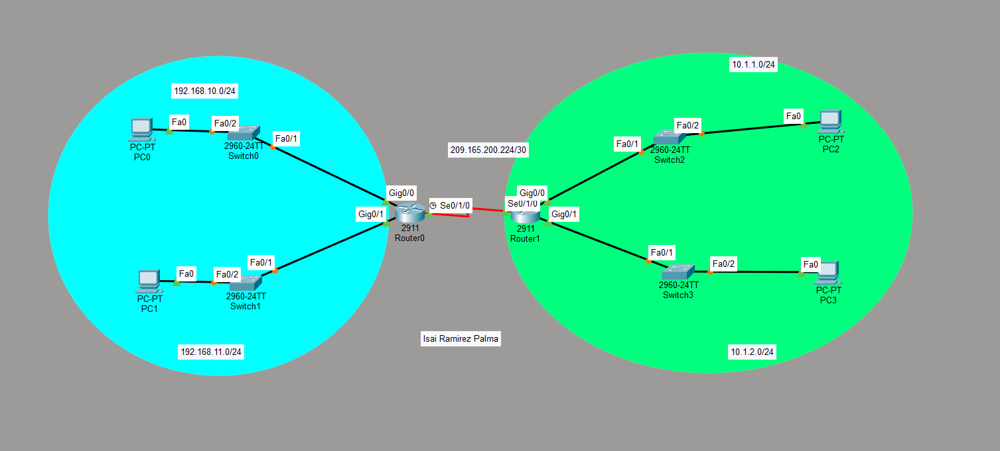

# Configuración de Red: Enrutamiento Estático y Flotante


---

# 2. Router Principal — RT‑01


## Configuración

```bash
enable
conf t
hostname RT-01

! ==============================
! Interfaces LAN
! ==============================

interface GigabitEthernet0/0
 description Gateway SW-01
 ip address 192.168.10.1 255.255.255.0
 no shutdown
 exit

interface GigabitEthernet0/1
 description Gateway SW-02
 ip address 192.168.11.1 255.255.255.0
 no shutdown
 exit

! ==============================
! Interface WAN (DCE)
! ==============================

interface Serial0/1/0
 description Enlace a RT-02
 ip address 209.165.200.225 255.255.255.252
 clock rate 64000
 no shutdown
 exit

! ==============================
! Enrutamiento Estático
! ==============================

! Ruta por defecto principal
ip route 0.0.0.0 0.0.0.0 209.165.200.226

! Ruta flotante de respaldo
ip route 0.0.0.0 0.0.0.0 209.165.200.226 10

end
copy run start
```

### Documentación

* La ruta con distancia administrativa **1** es la principal.
* La distancia **10** crea la ruta flotante.
* Solo se activa si la principal falla.

---

# 3. Router Remoto — RT‑02

## Función

* Gateway de la red 10.1.2.0.
* Extremo **DTE** del enlace serial.
* Retorno de tráfico hacia RT‑01.

## Configuración

```bash
enable
conf t
hostname RT-02

! ==============================
! Interface LAN
! ==============================

interface GigabitEthernet0/0
 description Gateway LAN Remota
 ip address 10.1.2.254 255.255.255.0
 no shutdown
 exit

! ==============================
! Interface WAN (DTE)
! ==============================

interface Serial0/1/0
 description Enlace a RT-01
 ip address 209.165.200.226 255.255.255.252
 no shutdown
 exit

! ==============================
! Enrutamiento Estático
! ==============================

! Ruta principal
ip route 0.0.0.0 0.0.0.0 209.165.200.225

! Ruta flotante
ip route 0.0.0.0 0.0.0.0 209.165.200.225 10

end
copy run start
```

### Documentación

* No se configura clock rate por ser DTE.
* Mantiene redundancia hacia el router principal.

---

# 4. Switches de Acceso — Gestión SVI

Las SVI permiten:

* Administración remota (Telnet / SSH / Ping).
* Monitoreo desde otra red.
* Gestión centralizada.

---

## SW‑01 — Red 192.168.10.0

```bash
enable
conf t

interface Vlan1
 ip address 192.168.10.2 255.255.255.0
 no shutdown
 exit

ip default-gateway 192.168.10.1

end
copy run start
```

**Documentación:**

* Gateway apunta a G0/0 de RT‑01.
* Permite gestión desde otras redes.

---

## SW‑02 — Red 192.168.11.0

```bash
enable
conf t

interface Vlan1
 ip address 192.168.11.2 255.255.255.0
 no shutdown
 exit

ip default-gateway 192.168.11.1

end
copy run start
```

**Documentación:**

* Asociado a la segunda LAN del router principal.

---

## SW‑03 — Red 10.1.1.0

```bash
enable
conf t

interface Vlan1
 ip address 10.1.1.2 255.255.255.0
 no shutdown
 exit

ip default-gateway 10.1.1.1

end
copy run start
```


* Gateway corresponde al router local de ese segmento.

---

## SW‑04 — Red 10.1.2.0

```bash
enable
conf t

interface Vlan1
 ip address 10.1.2.2 255.255.255.0
 no shutdown
 exit

ip default-gateway 10.1.2.254

end
copy run start

```




