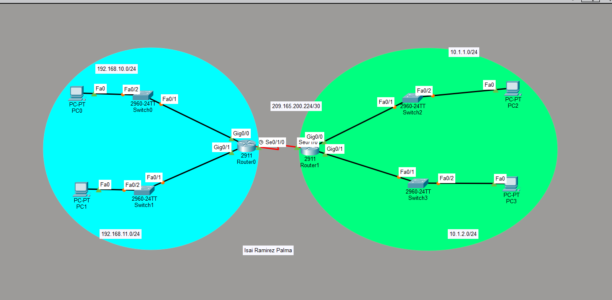

#  Enrutamiento Estático Predeterminada


---

# 1. Router Principal — RT‑01


Gateway de las redes 192.168.10.0 y 192.168.11.0. También funciona como extremo DCE del enlace serial.

```
enable
conf t

! --- Interfaces LAN ---
interface GigabitEthernet0/0
 ! Gateway de la red de SW-01
 ip address 192.168.10.1 255.255.255.0
 no shutdown
 exit

interface GigabitEthernet0/1
 ! Gateway de la red de SW-02
 ip address 192.168.11.1 255.255.255.0
 no shutdown
 exit

! --- Interface WAN (DCE) ---
interface Serial0/1/0
 ip address 209.165.200.225 255.255.255.252
 clock rate 64000
 no shutdown
 exit

! --- Ruta por defecto ---
ip route 0.0.0.0 0.0.0.0 209.165.200.226

end
copy run start
```

---

# 2. Router Remoto — RT‑02

**Función:**
Router que conecta la red 10.1.2.0 y recibe el enlace WAN.

```bash
enable
conf t

! --- Interface LAN ---
interface GigabitEthernet0/0
 ip address 10.1.2.254 255.255.255.0
 no shutdown
 exit

! --- Interface WAN (DTE) ---
interface Serial0/1/0
 ip address 209.165.200.226 255.255.255.252
 no shutdown
 exit

! --- Ruta por defecto ---
ip route 0.0.0.0 0.0.0.0 209.165.200.225

end
copy run start
```

---

# 3. Switches de Acceso — Gestión SVI

Las SVI permiten administrar los switches de forma remota (ping, telnet, ssh). Cada switch tiene una IP dentro de su red y usa como gateway al router que lo conecta con otras redes.

---

## SW‑01

**Conectado a:** RT‑01 por G0/0
**Red:** 192.168.10.0

Se usa para administrar los equipos de esa LAN y salir a otras redes a través de RT‑01.

```bash
enable
conf t

interface Vlan1
 ip address 192.168.10.2 255.255.255.0
 no shutdown
 exit

ip default-gateway 192.168.10.1

end
copy run start
```

---

## SW‑02

**Conectado a:** RT‑01 por G0/1
**Red:** 192.168.11.0

Permite gestionar dispositivos de su segmento y comunicarse con redes remotas mediante el router principal.

```bash
enable
conf t

interface Vlan1
 ip address 192.168.11.2 255.255.255.0
 no shutdown
 exit

ip default-gateway 192.168.11.1

end
copy run start
```

---

## SW‑03

**Conectado a:** Router local de la red 10.1.1.0
**Red:** 10.1.1.0

Su IP es solo de gestión. El gateway permite que pueda ser administrado desde otras redes.

```bash
enable
conf t

interface Vlan1
 ip address 10.1.1.2 255.255.255.0
 no shutdown
 exit

ip default-gateway 10.1.1.1

end
copy run start
```

---

## SW‑04

**Conectado a:** RT‑02 por G0/0
**Red:** 10.1.2.0

Administra la LAN remota y usa a RT‑02 para comunicarse con el resto de la topología.

```bash
enable
conf t

interface Vlan1
 ip address 10.1.2.2 255.255.255.0
 no shutdown
 exit

ip default-gateway 10.1.2.254

end
copy run start
```

---



