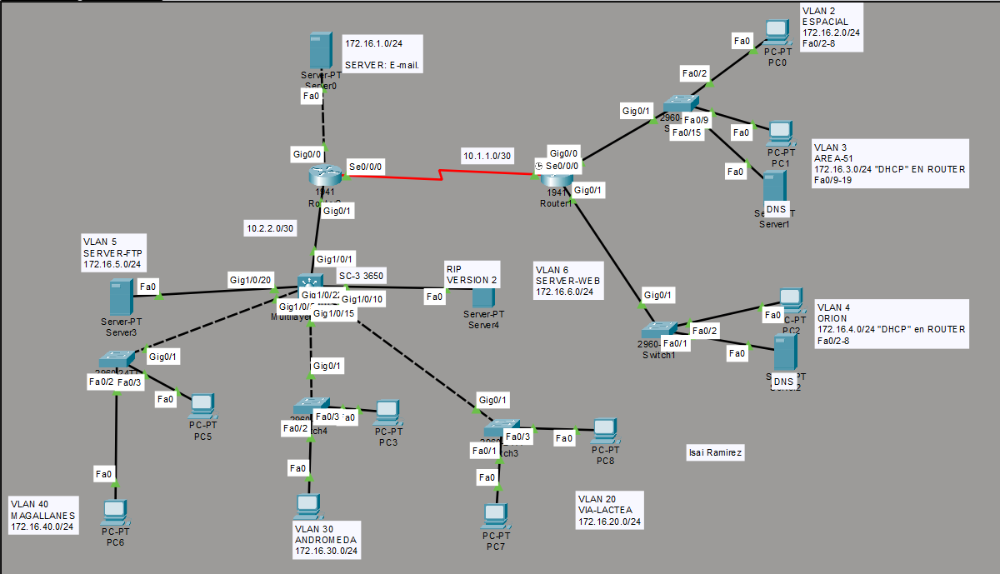
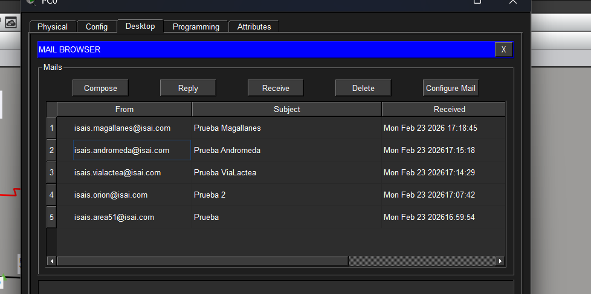
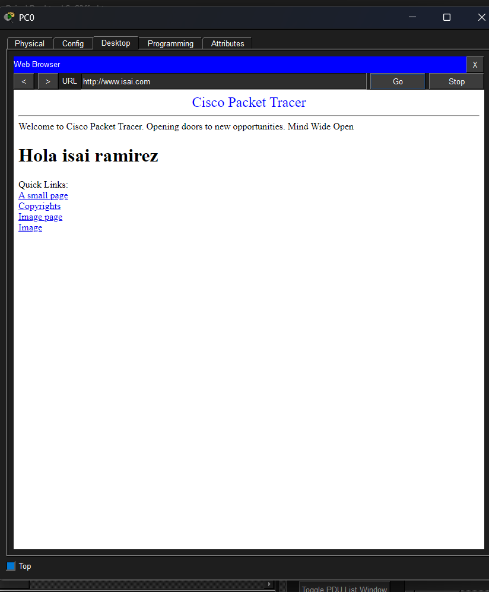
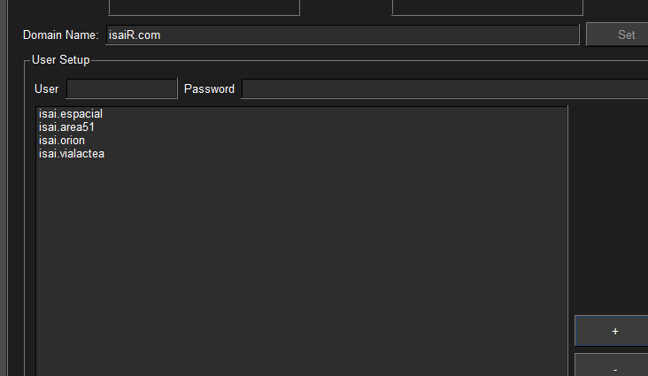
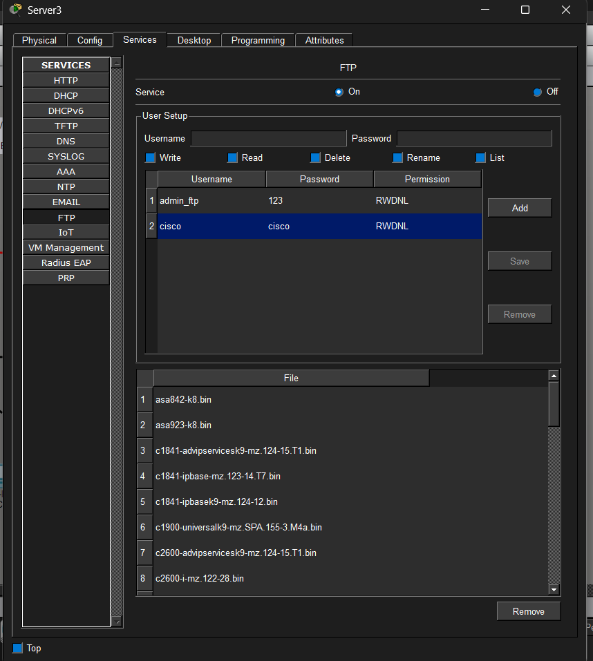

# Antes de comenzar quiera pedirles que si usan losscripts o la practica, cambien el nombre isai en toda la topologia como lo es en el servidor web en el index.html ,  en el servidor ftp , en el servidor mail ,  en el servidor DNS Ya que en todo se ocupo mi nombre como prefijos isai.com por ejemlo en las imagenes podran darse una idea de donde esta mi nombre.

#  CONFIGURACIÓN DEL ROUTER DERECHO (RT-01-Derecho)

Primero entro al modo configuración y cambio el nombre del router para identificarlo.

Después activo la interfaz que va al switch.

Luego creo subinterfaces para separar las VLAN:

 En la subinterfaz **g0/0.2** configuro la VLAN 2 y le asigno la IP 172.16.2.254 que será su puerta de enlace.
 En la subinterfaz **g0/0.3** configuro la VLAN 3 con IP 172.16.3.254 como gateway.

Después configuro la interfaz serial **s0/0/0** con IP 10.1.1.1 para comunicarme con el router izquierdo.

También configuro la interfaz **g0/1** con IP 172.16.4.254 para la red de la VLAN 4.

---

#  CONFIGURACIÓN DE DHCP EN RT-01

En cada VLAN activo DHCP para que las computadoras obtengan IP automática.

En cada red hago lo siguiente:

- Excluyo direcciones que no quiero que se asignen automáticamente (las primeras y las últimas).
- Creo un pool DHCP.
- Indico la red.
- Indico la puerta de enlace (la IP del router).
- Configuro el DNS 172.16.3.252.
- Asigno el dominio isai.com.

Repito el mismo procedimiento para VLAN 2, VLAN 3 y VLAN 4.

---

#  CONFIGURACIÓN DE RIP EN RT-01

Activo RIP versión 2 para que el router comparta sus redes automáticamente.

Agrego todas las redes conectadas:
- 172.16.2.0
- 172.16.3.0
- 172.16.4.0
- 10.0.0.0

Con esto permito que exista comunicación dinámica con los otros routers.

---

#  CONFIGURACIÓN DEL SWITCH (VLAN 2 Y 3)

Primero cambio el nombre del switch a SW-01.

Después creo las VLAN:
- VLAN 2 llamada ESPACIAL.
- VLAN 3 llamada AREA-51.

Asigno puertos:

- Los puertos fa0/2 al fa0/8 los pongo en VLAN 2.
- Los puertos fa0/9 al fa0/19 los pongo en VLAN 3.

Configuro los puertos Gig0/1 y Gig0/2 en modo trunk para que puedan pasar varias VLAN hacia el router.

---

#  CONFIGURACIÓN DEL ROUTER IZQUIERDO (RT-02-IZQUIERDO)

Cambio el nombre del router.

Configuro la interfaz g0/0 con IP 172.16.1.254, que es la red del servidor de correo.

Configuro la interfaz g0/1 con IP 10.2.2.2, que conecta con el switch de capa 3.

Configuro la interfaz serial s0/0/0 con IP 10.1.1.2 para comunicarme con el router derecho.

---

#  DHCP EN RT-02

Configuro DHCP para la red del servidor (172.16.1.0).

Excluyo algunas direcciones.
Defino el gateway como 172.16.1.254.
Defino el DNS como 172.16.3.252.
Asigno el dominio isai.com.

---

#  CONFIGURACIÓN DEL SWITCH CAPA 3

Primero activo el enrutamiento con `ip routing`.

Después creo las VLAN:

- VLAN 5 → SERVER-FTP
- VLAN 6 → SERVER-WEB
- VLAN 20 → VIA-LACTEA
- VLAN 30 → ANDROMEDA
- VLAN 40 → MAGALLANES

Luego configuro cada interfaz VLAN (SVI) y le asigno su IP, que funcionará como puerta de enlace para cada red.

Ejemplo:
- VLAN 5 → 172.16.5.254
- VLAN 6 → 172.16.6.254
- VLAN 20 → 172.16.20.254
- VLAN 30 → 172.16.30.254
- VLAN 40 → 172.16.40.254

Después asigno puertos físicos a cada VLAN según corresponda.

Configuro el puerto que va al router como puerto enrutado (no switchport) con IP 10.2.2.1.

---

#  DHCP EN SWITCH CAPA 3

En cada VLAN configuro DHCP igual que en los routers:

- Excluyo direcciones.
- Creo el pool.
- Defino red.
- Defino gateway.
- Defino DNS.
- Defino dominio.

Repito esto para:
- VLAN 5
- VLAN 6
- VLAN 20
- VLAN 30
- VLAN 40

---

#  RIP EN SWITCH CAPA 3

Activo RIP versión 2.

Agrego todas las redes:
- 172.16.5.0
- 172.16.6.0
- 172.16.20.0
- 172.16.30.0
- 172.16.40.0
- 10.0.0.0

Con esto permito que el switch capa 3 comparta rutas con los routers.

---

##  Topología de la red

##  Prueba de correos

##  Servidor Web

##  Servidor DNS

##  Servidor FTP

---

